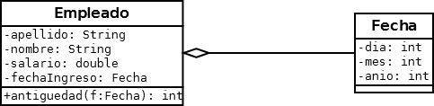

##  CLASE EMPLEADO

### Copie la clase Empleado realizada en el práctico anterior al paquete logica y agreguele el atributo **fechaIingreso** de tipo Fecha
 
### Realizar los cambios necesarios para que funcione correctamente.
### **(Método antiguedad)**: El método antiguedad devuelve la cantidad de años de antiguedad (año de la fecha actual - año de la fecha de Ingreso). Tener en cuenta que la fecha actual la recibe por parámetro. 
### En la ** clase Principal** deberá crear un objeto de tipo Empleado y verificar el correcto funcionamiento del método específico.

Nota: Se asume que la fecha de ingreso siempre será menor que la fecha actual