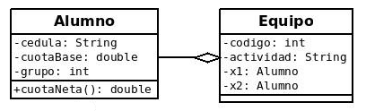

##  EQUIPOS DE ALUMNOS

### Descargue la carpeta **Equipos**, descomprimala y dejela en su carpeta Workspace de eclipse (recuerde que tiene que importar desde eclipse la carpeta que le queda adentro con el mismo nombre)

### 1)a)  Realice la clase **Alumno** en el paquete logica con los atributos que aprecia en su diagrama de clases. 
 
### b) **(Método cuotaNeta())**: El método cuotaNeta se calcula de la siguiente manera: si el grupo es 1 y la cuotaBase menor de 1000, abonarán un 80% de la cuotaBase, si el grupo es 2 o 3, abonarán un 70% y el resto un 100%. 
*Recuerde que en el teórico de la unidad 2 tiene un ejemplo muy parecido*

### 2) Realice la clase **Equipo** en el paquete logica con los atributos que aprecia en su diagrama de clases. 

### **Importante:** Tanto la clase Alumno como la clase Equipo tienen sus métodos básicos (constructores, getter, setter, toString), recuerde que la mayoría de ellos puede generarlo

### 3) En la ** clase Principal** crear  3 objetos de tipo Alumno. Además crear dos equipos con los alumnos creados anteriormente. 
>Por ejemplo: 

> 

### **Se pide:**
### • Desplegar por pantalla las cédulas de los integrantes del equipo 1, utilizando los métodos correspondientes (nota: No puede utilizar los objetos a1 y b1, debe utilizar e1).
### • Desplegar por pantalla las cuotas líquidas de los integrantes del equipo 2, utilizando los métodos correspondientes (nota: No puede utilizar los objetos a1 y b2, debe utilizar e2).
### • ¿Se puede invocar el método setCuotaBase sobre el objeto e1?. Justifique.

>**Una vez resuelto el ejercicio, borre la carpeta *Equipos* (la que está aquí) y suba su proyecto (el que tiene en Workspace de eclipse)**

