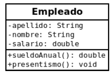

##  CLASE EMPLEADO

### Descargue la carpeta Ej3_Empleado, descomprimala y dejela en su carpeta Workspace de eclipse (recuerde que tiene que importar desde eclipse la carpeta que le queda adentro con el mismo nombre)

### Desarrollar la clase Empleado con la siguiente información:
 
### Incluir todo lo solicitado en los ejercicios anteriores. 
### Para los siguientes métodos se pide:
### • ** public double sueldoAnual()** : El método devuelve el salario anual percibido.
### • ** public void presentismo()**: Incrementa el valor de salario en un 10%.
### • ** public String toString()** : Devuelve atributos y salarioAnual().
### En la ** clase Principal** deberá crear un objeto de tipo Empleado y verificar el correcto funcionamiento de los métodos específicos.

### Una vez resuelto el ejercicio, borre la carpeta Ej3_Empleado (la que está aquí) y suba su proyecto (el que tiene en Workspace de eclipse)
